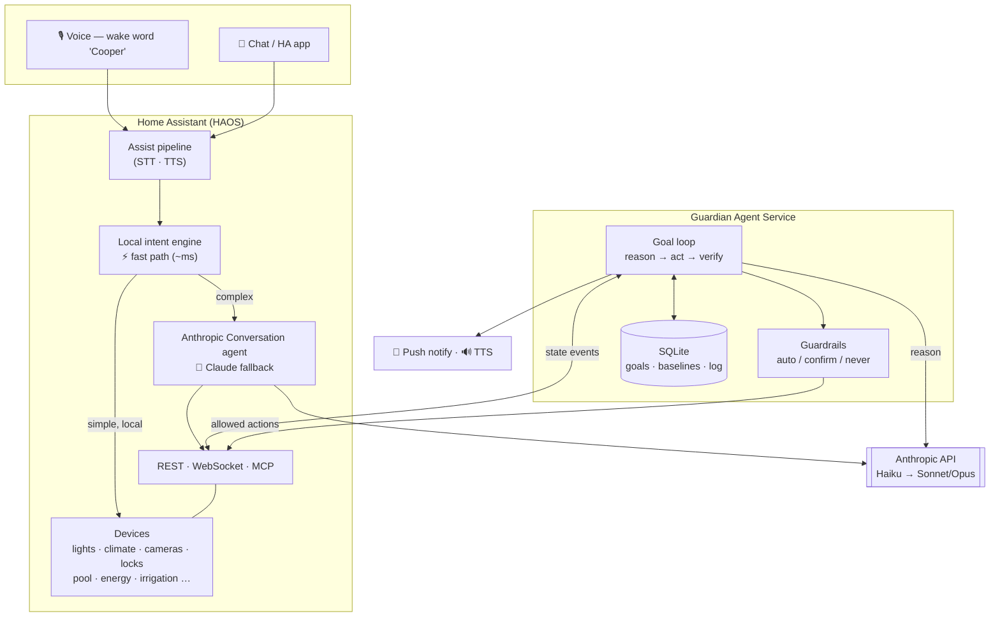

# Cooper

A **Claude-powered home agent** built on the Home Assistant MCP — an alternative to off-the-shelf
voice assistants that's both *faster* on common commands and *genuinely intelligent* on the hard
stuff. The point isn't more automations ("if X then Y"); it's a **goal-driven agent** you address
in plain language —

> "keep an eye while I'm out" · "the kids are home, look after the house" · "the pool seems dirty, clean it"

— that reasons over **live state**, acts via **live MCP invocations**, exercises judgment, and
persists over time.

## Architecture at a glance

Three layers:
1. **Voice/chat front-end** — HA Assist with a hybrid agent: local intents handle common commands
   in milliseconds; Claude handles anything conversational/ambiguous/multi-step.
2. **Guardian agent service** — the novel core: a persistent, goal-driven Claude agent that
   watches and acts with judgment. See [docs/ARCHITECTURE.md](docs/ARCHITECTURE.md).
3. **Proactive layer** — briefings, anomaly alerts, freeze/leak/energy guardians.

## Status

- **Phase 0 — registry hygiene:** clean the HA entity registry so the agent only ever sees real,
  live devices (a dirty registry makes an agent hallucinate capabilities). In progress.
- **Tracks A & B:** begin after Phase 0.

## Docs

| Doc | What's in it |
|---|---|
| [ARCHITECTURE.md](docs/ARCHITECTURE.md) | System design, the goal-loop, deployment topology, diagrams |
| [PLAN.md](docs/PLAN.md) | Phased build roadmap |
| [USE-CASES.md](docs/USE-CASES.md) | What it can do |
| [GUARDRAILS.md](docs/GUARDRAILS.md) | Autonomy model (act on safe / confirm risky / never) |

## Design notes

- **Hosting:** runs as a small always-on service. Prefer a **LAN-local host** (low latency to HA,
  no dependency on the internet for local control); a cloud VPS works for interim development.
- **Keys:** dedicated, project-specific Anthropic API key + a dedicated scoped HA token — never
  reuse other projects' keys, never commit them (`.env` / a secrets manager only).
- This repo is **public-bound**: architecture/design only, no home-specific data (see
  [CLAUDE.md](CLAUDE.md)).
