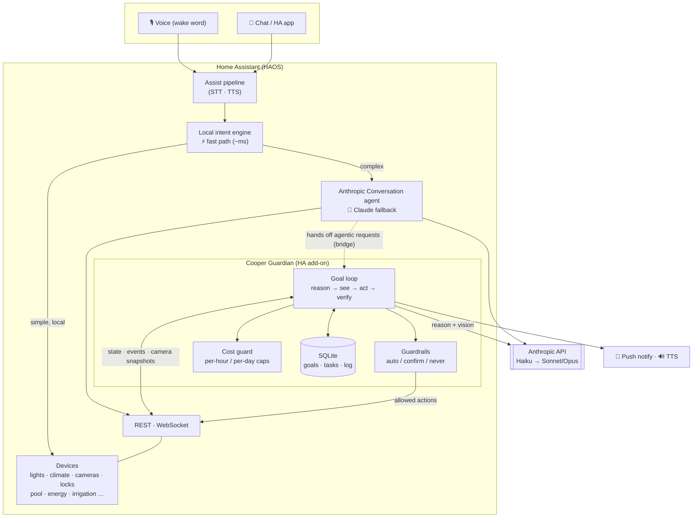

  <picture>
    <source media="(prefers-color-scheme: dark)" srcset="brand/cooper-lockup-dark.svg">
    
  </picture>

<b>A home you can talk to.</b> A Claude-powered agent for Home Assistant — you say what you <i>want</i>, it figures out the <i>how</i>.

> **You:** *"I'm leaving for an hour — keep an eye on the cameras."*
> **Cooper:** *"On it. I'll watch the perimeter and flag anything that moves. Have a good hour."*

Not "if motion after sunset, then porch light." Cooper **reasons over your live home**, **sees through your cameras** (real vision, not motion pings), **acts** on the safe stuff, **asks** before the risky stuff, and **remembers** what it's watching across restarts. Deadpan personality optional.

## What it can do

🎙️ **Talk to your whole home.** Ask anything, phrased any way. Common commands resolve locally in
milliseconds; anything conversational, ambiguous, or multi-step falls back to Claude — with live
**web search** built in (*"will it rain on my drive home?"*).

👁️ **Actually sees your cameras.** When a person/motion sensor trips, Cooper pulls a live snapshot
and *looks*:

> 📲 *"Someone's on the driveway — looks like a delivery driver, just dropped a box by the garage
> and left."*

Not "motion detected at 2:47pm" — a description of **what's actually happening**.

🛡️ **Watches with judgment, not rules.** *"Keep an eye out"* learns what's normal and only pings
you when something genuinely warrants it — a door opening when no one's home, the garage left open
at night, a person in the yard after dark.

🏖️ **Goes away with you — and house-sits.** *"We're out until Monday evening — keep an eye on the
place and make it look like someone's home."* Cooper runs a time-boxed watch **and simulates
presence intelligently**: lights, TV and blinds follow your *actual* routines and the sunset,
varied night to night so it never loops like a robotic timer, winding down at a believable bedtime.
If a camera catches someone lingering at the gate, it escalates to a **critical** alert with the
photo. And it **stands down the moment you're all home again** — not on a guessed clock — with a
time cap as a backstop.

🤖 **Acts safely.** Reversible things (lights, climate, media, fans) just happen. Risky things
(locks, alarm, garage, water valve) **always ask first**. Forbidden things **never** happen. Ships
in observe-only mode with a kill switch.

🧠 **Remembers & is cheap to run.** Watch-goals persist across restarts (SQLite). Camera-watching is
*event-driven* — one snapshot per trigger, never a live video feed to the cloud — with hard
hourly/daily spend caps and live token accounting. **Idle costs nothing.**

See [docs/USE-CASES.md](docs/USE-CASES.md) for the full catalog.

## Why not just automations?

Automations are rules you write in advance — *IF this AND this THEN that*. You can't enumerate
every situation; there's always one more `IF`. Cooper reasons in the moment instead:

- An automation fires the same for a raccoon, a delivery, and a stranger. Cooper **looks** and
  tells you which.
- New behavior is a sentence (*"watch the backyard tonight"*), not a blueprint — anyone can direct it.
- Rename a device and a rule breaks silently. Cooper works off what's actually there.
- *"Is everything okay at home?"* is one question, not a web of rules.

It doesn't replace automations — fast local rules handle the reflexes (porch light at sunset);
Cooper is the **judgment layer** on top.

> Automations are a vending machine. Cooper is a concierge.

## Architecture at a glance

Two cooperating layers, both inside Home Assistant:

1. **Voice/chat front-end** — HA Assist with a hybrid agent: local intents handle common commands
   in milliseconds; Claude handles anything conversational, ambiguous, or multi-step.
2. **Cooper Guardian add-on** — the novel core: a persistent, goal-driven Claude agent that
   watches (with **vision**) and acts with **judgment**, gated by **guardrails** and a **cost
   guard**, with **SQLite** persistence. See [docs/ARCHITECTURE.md](docs/ARCHITECTURE.md).

The two are joined by a small **custom integration** (`custom_components/cooper/`) that registers the
Guardian directly as a Home Assistant **conversation agent**. Set Assist's agent to **Cooper** and
every utterance goes straight to the Guardian over HTTP — it reasons, acts, and the assistant speaks
the reply, with conversation **memory** (follow-ups) and **in-chat confirmations** ("unlock the front
door — yes or no?"). One brain, a direct request/response.

## Install & setup

Two parts — the **add-on** (the brain) and the **integration** (the voice):

1. **Add-on** — **Settings → Add-ons → Add-on Store → ⋮ → Repositories**, add
   `https://github.com/kunalkhosla/cooper`, install **Cooper Guardian**, set your Anthropic key, start
   it. On first run it self-provisions the **kill-switch** helper (`input_boolean.cooper_pause`).
2. **Integration** — install `custom_components/cooper/` (via HACS as a custom repository, or copy it
   to `/config/custom_components/`), **restart HA**, then **Settings → Devices & Services → Add
   Integration → Cooper** and point it at the add-on (`http://homeassistant.local:8099`). Finally set it
   as your Assist **conversation agent** (Settings → Voice assistants).

> **👉 Full step-by-step instructions — prerequisites, configuration, first use, troubleshooting — are in
> [docs/SETUP.md](docs/SETUP.md).** Start there.

It also runs as a plain Docker container for local development (`HA_URL` + `HA_TOKEN` instead of the
supervisor token).

## Docs

| Doc | What's in it |
|---|---|
| [ARCHITECTURE.md](docs/ARCHITECTURE.md) | System design, the goal-loop, deployment topology, diagrams |
| [USE-CASES.md](docs/USE-CASES.md) | The full catalog of what it can do |
| [MIGRATING-FROM-AUTOMATIONS.md](docs/MIGRATING-FROM-AUTOMATIONS.md) | What to keep as automations, what to move to Cooper, and the hybrid pattern |
| [GUARDRAILS.md](docs/GUARDRAILS.md) | Autonomy model — act on safe / confirm risky / never |
| [PLAN.md](docs/PLAN.md) | Phased build roadmap |

## Design notes

- **Hosting:** runs as an always-on HA add-on — LAN-local, low latency to your devices, no
  dependency on the internet for local control.
- **Keys:** a dedicated, project-specific Anthropic API key + a scoped HA token — never reuse other
  projects' keys, never commit them (use the add-on's options, never source control).
- This repo is **public-bound**: architecture and design only, no home-specific data (see
  [CLAUDE.md](CLAUDE.md)).
