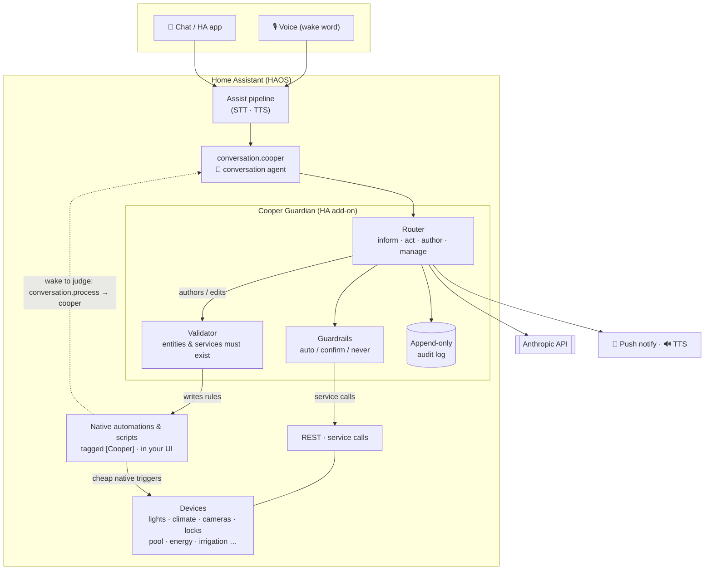

  <picture>
    <source media="(prefers-color-scheme: dark)" srcset="brand/cooper-lockup-dark.svg">
    
  </picture>

<b>A home you can talk to.</b> A Claude-powered agent for Home Assistant — you say what you <i>want</i>, it figures out the <i>how</i>.

> **You:** *"I'm leaving for an hour — keep an eye on the cameras and ping me if anyone shows up."*
> **Cooper:** *"On it. I've set up a rule that'll watch the driveway and check the camera if motion trips — I'll text you if it's a person. Have a good hour."*

Not "if motion after sunset, then porch light." Cooper **reasons over your live home**, **sees through your cameras** (real vision, not motion pings), **acts** on the safe stuff, **asks** before the risky stuff, and — for anything ongoing — **writes a real Home Assistant automation you can see and edit**. Deadpan personality optional.

## What it can do

🎙️ **Talk to your whole home.** Ask anything, phrased any way — *"is the garage closed?"*, *"warm up the living room,"* *"will it rain on my drive home?"*. Cooper grounds itself in your HA **areas** and **device classes**, so *"the backyard"* resolves to every entity actually out there — not a guessed name — and live **web search** is built in for the world beyond your walls.

👁️ **Actually sees your cameras.** When a rule wakes it to look, Cooper pulls a live snapshot and *looks*:

> 📲 *"Someone's on the driveway — looks like a delivery driver, just dropped a box by the garage
> and left."*

Not "motion detected at 2:47pm" — a description of **what's actually happening**.

🛡️ **Writes rules with judgment baked in.** *"Alert me when someone's at the gate after dark"* becomes a **native HA automation** Cooper authors for you — cheap local triggers do the watching, and when one fires, the rule calls *back* to Cooper to **look at the camera and decide** whether it's worth a ping. Judgment where it matters, no polling where it doesn't.

🏖️ **Goes away with you — and house-sits.** *"We're out until Monday — keep an eye on the place and make it look like someone's home."* Cooper **writes a presence-simulation script** — lights, TV and blinds varied night to night so it never loops like a robotic timer — plus a watch rule that escalates to a **critical** alert with a photo if a camera catches someone lingering. The rules live in HA, run themselves, and **clean up when the trip's over**.

🤖 **Acts safely.** Reversible things (lights, climate, media, fans, scenes) just happen, then it confirms. Risky things (locks, alarm, garage, water valve, siren) **always ask first** — a real yes/no, in-chat while you're talking or a push notification otherwise. Forbidden things **never** happen. The same guardrails vet the actions *inside* any rule Cooper writes. Ships in observe-only mode with a kill switch.

🧠 **Cheap to run, and yours to keep.** The rules Cooper writes are **plain Home Assistant** — they survive restarts, show up in your Automations/Scripts UI, and run on native triggers with **no Cooper polling**. Idle costs nothing; Cooper only thinks when a rule actually wakes it. Replies stream token-by-token, and *"ping me"* targets the phone you're talking from.

See [docs/USE-CASES.md](docs/USE-CASES.md) for the full catalog.

## Why not just automations?

Automations are rules you write in advance — *IF this AND this THEN that*. You can't enumerate
every situation, and you shouldn't have to hand-write YAML for each one. So Cooper **writes the
automation for you** — from a sentence — and adds judgment where a static rule falls short:

- A plain automation fires the same for a raccoon, a delivery, and a stranger. Cooper's rule
  **calls back to look** and tells you which.
- New behavior is a sentence (*"watch the backyard tonight"*), not a blueprint — anyone can direct it.
- Rename a device and a hand-written rule breaks silently. Cooper works off your areas and what's
  actually there.
- *"Is everything okay at home?"* is one question, not a web of rules.

It doesn't replace automations — it **authors** them. Fast local triggers still handle the reflexes
(porch light at sunset); Cooper is the **judgment layer** that writes them and gets woken when a
decision is needed.

> Automations are a vending machine. Cooper is a concierge — who happens to write the automations.

## Architecture at a glance

Cooper is a **router** over Home Assistant. For every request it picks the right shape of response:

| Request | Cooper does |
|---|---|
| **Inform** — *"is the back door locked?"*, *"did anyone come by today?"* | Reads live context / history / camera vision / forecast / web, answers |
| **Act now, reversible** — lights, fans, media, climate, scenes | Calls the service, confirms |
| **Act now, risky** — locks, alarm, valve, garage, siren | Asks **yes/no** first, acts only on *yes* |
| **Durable / ongoing / scheduled** — *"alert me when…"*, *"every evening…"*, *"run the pump 10 min"*, house-sitting | **Writes a native HA automation or script**; HA runs it |
| **Manage** — *"what are you watching?"*, *"stop that"* | Lists / edits / deletes its own `[Cooper]` rules |

Cooper is three things wearing one coat:

1. **Router** — every utterance hits `conversation.cooper` and gets sorted: answer it, do it, or
   build something durable for it.
2. **Compiler** — for anything ongoing, it **writes a real native HA automation or script**.
   Lifecycle (*today*, *tonight*, *until Monday*, *three times then stop*) is expressed in plain
   HA constructs — date/time conditions, overnight windows, counter helpers, self-disable — not
   hidden Cooper flags. A **deterministic validator** guarantees every entity and service in a rule
   actually exists, plus an advisory check that the rule matches what you asked for. One-shot rules
   that can no longer fire get cleaned up automatically.
3. **Judgment oracle** — the rules Cooper writes call **back** to it (`conversation.process` →
   `conversation.cooper`) for the smart step: *look at the camera, is this a delivery?*

**Home Assistant is the durable execution substrate** — it stores the rules, runs the triggers, and
survives restarts. The add-on holds only an **append-only audit log** of what Cooper did; the rules
themselves live in HA, visible and editable. See [docs/ARCHITECTURE.md](docs/ARCHITECTURE.md).

## Install & setup

Two parts — the **add-on** (the brain) and the **integration** (the voice):

1. **Add-on** — **Settings → Add-ons → Add-on Store → ⋮ → Repositories**, add
   `https://github.com/kunalkhosla/cooper`, install **Cooper Guardian**, set your Anthropic key, start
   it. On first run it self-provisions the **kill-switch** helper (`input_boolean.cooper_pause`).
2. **Integration** — install `custom_components/cooper/` (via HACS as a custom repository, or copy it
   to `/config/custom_components/`), **restart HA**, then **Settings → Devices & Services → Add
   Integration → Cooper** and point it at the add-on (`http://homeassistant.local:8099`). Finally set it
   as your Assist **conversation agent** (Settings → Voice assistants).

> **👉 Full step-by-step instructions — prerequisites, configuration, first use, troubleshooting — are in
> [docs/SETUP.md](docs/SETUP.md).** Start there.

It also runs as a plain Docker container for local development (`HA_URL` + `HA_TOKEN` instead of the
supervisor token).

## Docs

| Doc | What's in it |
|---|---|
| [ARCHITECTURE.md](docs/ARCHITECTURE.md) | System design — routing, rule-authoring, the judgment callback, deployment topology |
| [USE-CASES.md](docs/USE-CASES.md) | The full catalog of what it can do |
| [MIGRATING-FROM-AUTOMATIONS.md](docs/MIGRATING-FROM-AUTOMATIONS.md) | What to keep as automations, what to let Cooper author, and the hybrid pattern |
| [GUARDRAILS.md](docs/GUARDRAILS.md) | Autonomy model — act on safe / confirm risky / never |
| [PLAN.md](docs/PLAN.md) | Phased build roadmap |

## Design notes

- **Native, not bespoke:** Cooper doesn't run its own watch loop. It **compiles** your intent into
  ordinary Home Assistant automations and scripts, so HA's battle-tested engine does the running —
  cheap triggers, restart-safe, fully visible and editable in your UI.
- **Grounded in your home:** it reasons over HA **areas** and **device classes**, so requests
  resolve to the entities that are really there — rename-proof, no name guessing.
- **Safe by construction:** tiered guardrails (auto reversible / confirm risky with a real yes-no /
  never forbidden) gate both direct actions and the actions inside any rule it writes; a validator
  rejects rules referencing entities or services that don't exist. Observe mode by default, with a
  kill switch (`input_boolean.cooper_pause`).
- **Hosting:** runs as an always-on HA add-on — LAN-local, low latency to your devices, no
  dependency on the internet for local control.
- **Keys:** a dedicated, project-specific Anthropic API key + a scoped HA token — never reuse other
  projects' keys, never commit them (use the add-on's options, never source control).
- This repo is **public-bound**: architecture and design only, no home-specific data (see
  [CLAUDE.md](CLAUDE.md)).
