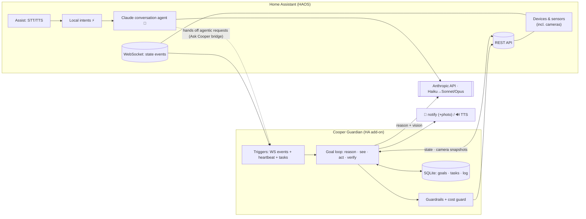
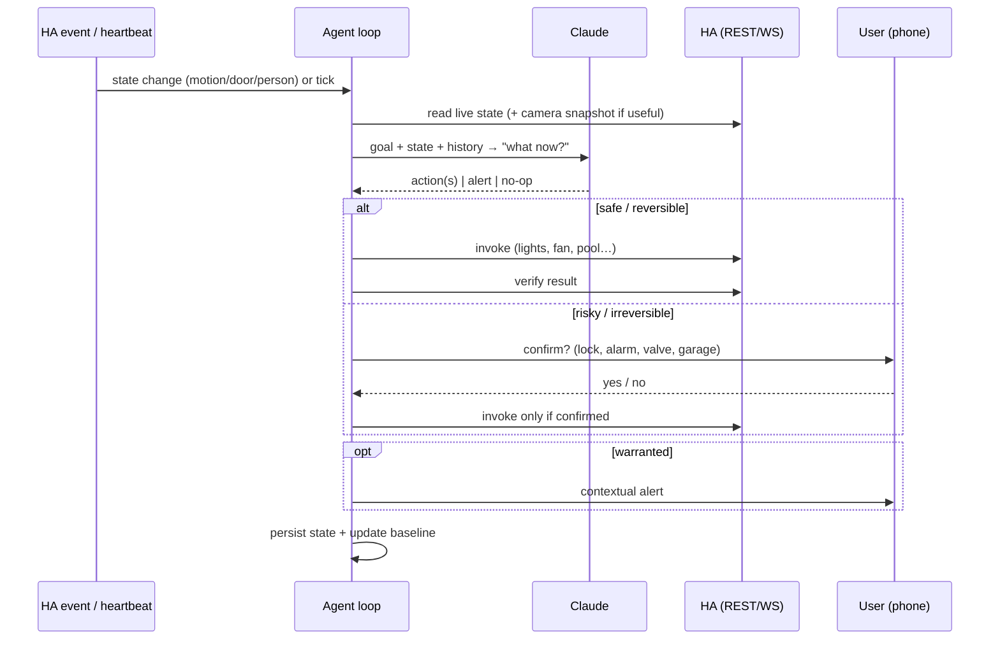
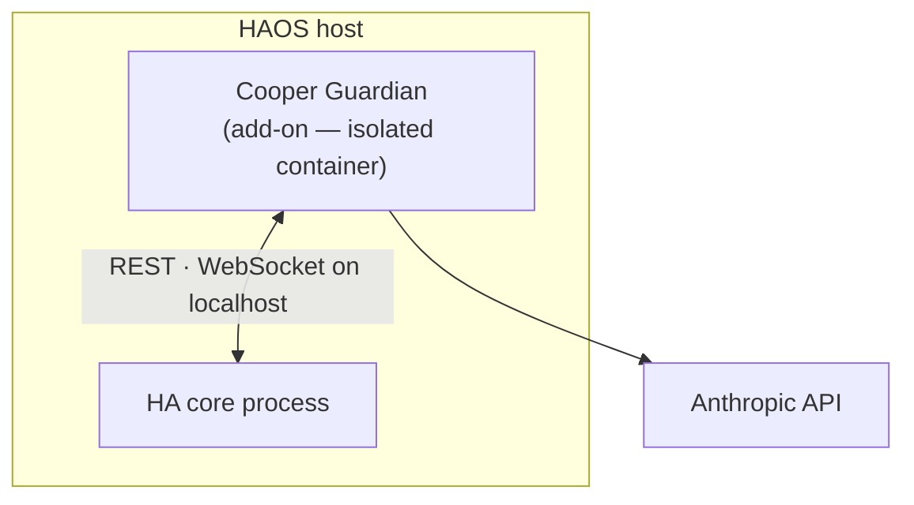

# Architecture

## Design principle

Beat off-the-shelf voice assistants on **both** axes:
- **Speed** — common commands ("turn off the kitchen lights") resolve via HA's local intent
  engine in ~milliseconds, no LLM round-trip.
- **Intelligence** — anything conversational, ambiguous, or multi-step falls through to Claude,
  which reasons and can fire several coordinated actions.

A naive "send everything to an LLM" design would be *slower* than a local assistant. The hybrid
fast-path + smart-path is the whole trick.

## Three layers

### Layer 1 — Voice/chat front-end
HA's **Assist** pipeline (wake word → STT → conversation agent → TTS) with the conversation agent
set to **prefer local intents, fall back to Claude** (HA *Anthropic Conversation* integration).
HA-config only — no service to host. Voice satellites (HA Voice PE / ESPHome, "Cooper" wake word)
are an optional later add; text/app works day one. On Android, HA Assist can be set as the
device's default assistant (replacing the stock one).

**What the front-end answers** (when set as your phone assistant):
- ✅ Home control, general knowledge, unit conversions, reasoning (Claude's own knowledge).
- ✅ Local weather — from the HA weather entity (current + forecast), not a web lookup.
- ✅ **Live web / real-time facts** (news, scores, "search the web") — via Anthropic's **native
  `web_search`** server-tool, enabled on the HA *Anthropic Conversation* integration. No third-party
  search key needed. This was the gate for replacing a stock cloud assistant on a phone — resolved.

The guardian (Layer 2) hands off from the phone via a lightweight **bridge** (an exposed "Ask
Cooper" script → an `input_text` helper it watches), so anything agentic said to the phone routes
to the guardian. The bridge is **synchronous when it can be**: the script blocks briefly (~9s)
waiting for Cooper to write its reply to a second `input_text` helper, so the assistant **speaks
Cooper's answer inline** for quick requests; longer agentic tasks time out gracefully ("On it —
I'll notify you") and Cooper delivers the result by push when it's done.

### Layer 2 — Guardian agent service (the novel core)
A persistent, goal-driven Claude agent (an HA add-on). Goal shapes, one engine:
- **Watch-goals** ("keep an eye", "look after the house") — long-running; wakes on HA WebSocket
  state-changes (instant, incl. camera person/motion sensors) + a periodic heartbeat; acts/alerts
  **only when warranted**. Time-boxable ("until Monday"), presence-aware (stand down when everyone's
  home), and can be **standing** (auto-arm whenever everyone leaves).
- **Do-goals** ("clean the pool", "make it cozy") — one-shot: interpret → act → **verify** → report.
- **Tasks** (deferred do-goals) — fire on a scheduled time or on arrival home ("prepare the house").

Tools the agent wields: `get_live_context`, **`look_at_camera`** (vision — pulls a live snapshot and
*sees* the scene), `call_service` (guardrailed, anti-hallucination-checked), **`get_forecast`** (HA's
local forecast), **`schedule_actions`** (plans + runs its own timed sequence — e.g. presence
simulation), native `web_search`, and `notify` (with a camera photo + an agent-chosen urgency:
normal / high / critical). A **cost guard** caps automatic LLM calls per hour/day; everything is
event-driven (one snapshot per trigger, never a live video feed), so idle costs nothing.

### Layer 3 — Proactive layer
Scheduled/event-driven intelligence the agent initiates: morning briefing, anomaly heads-up,
freeze/leak/energy guardians, "leave-soon" nudges. Emerges from the Layer 2 engine.

## System diagram

## The goal loop

## Deployment — a Home Assistant add-on

Cooper Guardian ships as an **HA add-on**: an *isolated container* managed by HA's supervisor (not
code running inside HA's process). It runs on the HA box itself, so it's **LAN-local, low-latency,
and survives WAN outages** from day one, with no separate host to maintain.

Why an isolated add-on rather than a custom integration that runs *inside* HA: a long-running LLM
agent with a bug or memory leak should never be able to take the whole smart home down with it. An
add-on container is firewalled from HA core — its blast radius is itself.

The same image also runs as a plain **standalone Docker container** for local development (point it
at HA with `HA_URL` + `HA_TOKEN` instead of the supervisor token) — handy for iterating without a
build/install cycle on the HA box.

## Tech stack

- **Language/SDK:** TypeScript + `@anthropic-ai/sdk` — a tool-use loop (`addon/src/`).
- **Model tiering:** Haiku for cheap routine checks; Sonnet for sharper judgment & multi-step
  planning (configurable). Event-driven (one call per real trigger) + cost caps → low cost.
- **HA access:** REST + WebSocket only — live state, the state-change subscription, service calls,
  camera snapshots (`camera_proxy`), the weather forecast service, and `notify`. No MCP, no shell.
- **State:** SQLite (`/data`) — goals, tasks, action log.
- **Deploy:** a Home Assistant **add-on** (`config.yaml` + `Dockerfile`); `GET /healthz` +
  `POST /goal` control surface. The same image runs as a standalone container for local dev.
- **Secrets:** a dedicated project Anthropic key (add-on option / env); never committed.

## Tool-use safety order

The guardian reaches HA only through its **REST + WebSocket** API — the least-powerful surface that
does the job, with **no shell and no config-file access** (so a bug can't rewrite your HA config).
Its tiered guardrails ([GUARDRAILS.md](GUARDRAILS.md)) encode the same least-privilege, human-in-
the-loop-on-irreversible posture for the actions themselves.
