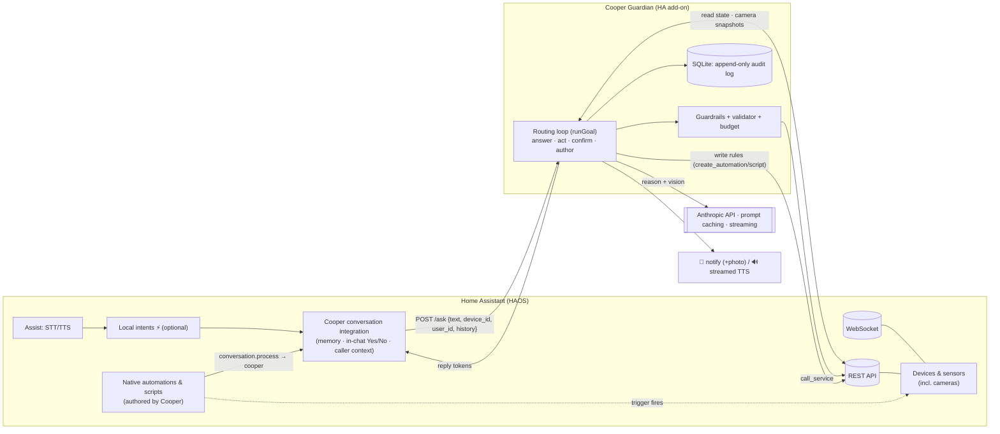
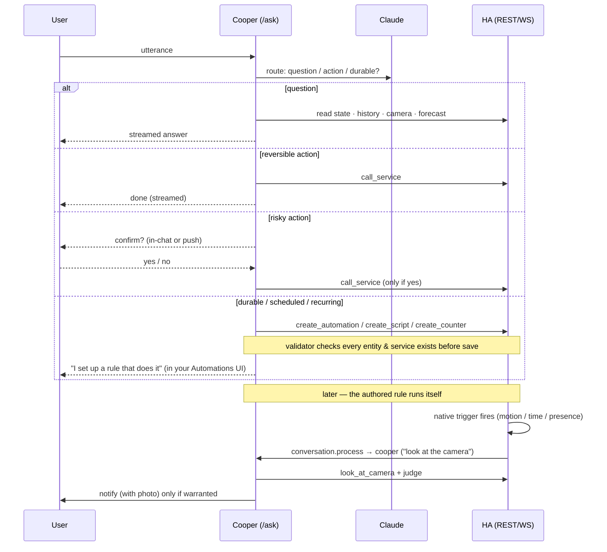
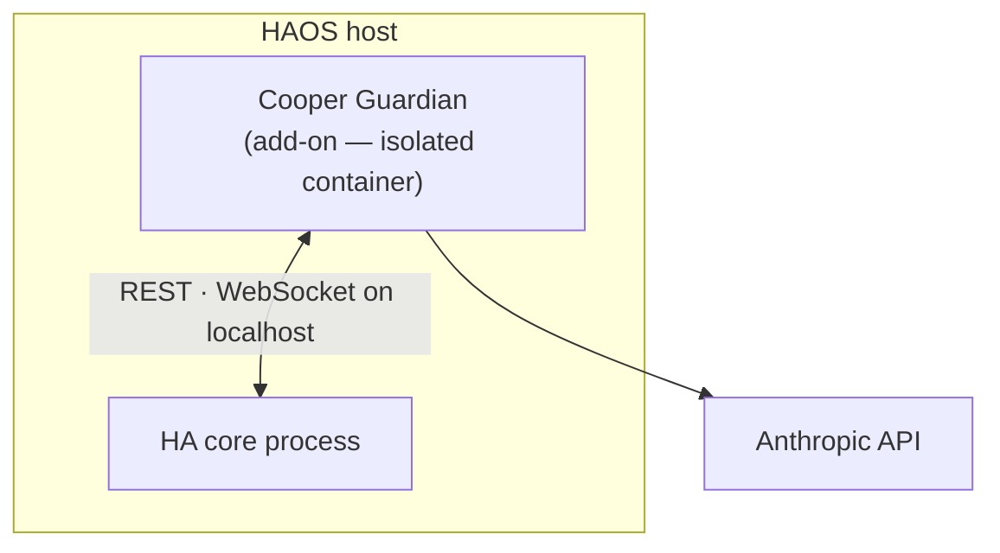

# Architecture

## Design principle

Cooper is a **routing agent over Home Assistant** — not an automation engine. It doesn't poll, hold
a watch loop, or keep its own state machine running in the background. Each thing you say is a single
turn: Cooper *routes* it to the cheapest surface that does the job, and HA does the durable work.

Three jobs, one brain:
- **Router** — answer questions, fire reversible actions, gate risky ones behind a Yes/No.
- **Compiler** — anything durable, ongoing, scheduled, or recurring gets **authored as a native HA
  automation or script** that HA runs itself. Cheap native triggers, survive restarts, visible and
  editable in your Automations UI.
- **Judgment oracle** — when a rule needs a *smart* step ("is that actually a person at the door?"),
  the authored rule calls back into Cooper for that one decision, then HA carries on.

The payoff: **idle costs nothing.** There is no heartbeat and no Cooper-held state. HA's own triggers
wake Cooper only on real events, never on a loop.

## Two parts

### Part 1 — The integration (Cooper *is* the conversation agent)

`custom_components/cooper/` registers Cooper directly as a Home Assistant **Assist** conversation
agent (wake word → STT → conversation agent → TTS). On every turn it forwards
`{ text, device_id, user_id, conversation history }` to the add-on via `POST /ask`, and **streams
Cooper's reply token-by-token** into HA's chat log — so the voice pipeline can start speaking within
~1s instead of waiting for the whole answer.

Two things live in this layer because they're conversational, not agentic:
- **Conversation memory** — follow-ups like "now turn it off" resolve against history.
- **In-chat Yes/No confirmations** — "Unlock the front door — yes or no?" → "yes", inline in the
  same chat turn.

Forwarding `device_id` / `user_id` gives the add-on **caller context**: when you say "ping me,"
Cooper targets *your* phone, not a hardcoded device.

**Optional local fast-path:** enable HA's *"prefer handling commands locally"* and expose your core
entities to Assist — HA then resolves simple commands ("turn off the kitchen lights") with its local
intent engine in milliseconds, falling through to Cooper only for anything conversational, ambiguous,
or multi-step. Without it, every utterance is a Cooper eval (a few seconds). Voice satellites
(HA Voice PE / ESPHome, "Cooper" wake word) are an optional add; text/app works day one. On Android,
HA Assist can be the device's default assistant.

### Part 2 — The add-on ("Cooper Guardian", the brain)

An **isolated HA add-on container** (also runs standalone via `HA_URL` + `HA_TOKEN`). TypeScript +
`@anthropic-ai/sdk`, a tool-use loop (`runGoal` in `agent.ts`) with **prompt caching**, **token
streaming**, and **budget/cost tracking**. It reaches HA over **REST + WebSocket only** — no shell,
no config-file access.

Every utterance arrives as `POST /ask`, and Cooper **routes** it:

- **A question** → read tools, then answer:
  - `get_live_context` — current state, each entity tagged with its **area** + `device_class`
  - `get_home_map` — areas → entities
  - `get_history` — what changed and when
  - `look_at_camera` — pulls a live snapshot and *sees* the scene (vision)
  - `get_forecast` — HA's local weather
  - `web_search` — live web facts
- **A reversible action** → `call_service` directly (guardrailed, anti-hallucination-checked).
- **A risky action** → Yes/No confirm (in-chat or push), act only on "yes".
- **Anything durable / ongoing / scheduled / recurring** → Cooper **authors a native HA rule**:
  - `create_automation` / `create_script` — HA owns the trigger and the schedule
  - the *smart* step inside a rule (e.g. "judge whether that's a person") is an action calling
    `conversation.process` back to `conversation.cooper` — so the rule stays cheap until the moment
    judgment is actually needed
  - "do this N times" uses a real HA **counter helper** (`create_counter`), not a Cooper flag
  - lifecycle ("until Monday", "while we're away") is expressed as **native HA conditions**, never
    Cooper-held state

So the model is: **Cooper = router + compiler + judgment oracle; HA = the durable execution
substrate.** No polling, no heartbeat, nothing for Cooper to keep alive.

## System diagram

## Routing & authoring flow

## Deployment — a Home Assistant add-on

Cooper Guardian ships as an **HA add-on**: an *isolated container* managed by HA's supervisor (not
code running inside HA's process). It runs on the HA box itself, so it's **LAN-local, low-latency,
and survives WAN outages** from day one, with no separate host to maintain.

Why an isolated add-on rather than an integration that runs *inside* HA: an LLM agent with a bug
should never be able to take the whole smart home down with it. An add-on container is firewalled
from HA core — its blast radius is itself.

The same image also runs as a plain **standalone Docker container** for local development (point it
at HA with `HA_URL` + `HA_TOKEN` instead of the supervisor token) — handy for iterating without a
build/install cycle on the HA box.

## Control surface

The add-on exposes exactly two endpoints — nothing else:

- **`GET /healthz`** — status (`ok` / `observe` / `paused` / `budget`).
- **`POST /ask`** — `{ text, session_id, history?, device_id?, user_id?, stream? }` → `{ reply }`.
  With `stream: true`, the reply is an **NDJSON token stream** (what feeds inline TTS).

There is no `POST /goal`, no task/sequence/goal lifecycle API — Cooper doesn't own durable jobs, HA
does.

## Tech stack

- **Language/SDK:** TypeScript + `@anthropic-ai/sdk` — a tool-use loop (`runGoal` in
  `addon/src/agent.ts`) with prompt caching, token streaming, and per-window budget/cost tracking.
- **HA access:** REST + WebSocket only — live state, service calls, camera snapshots
  (`camera_proxy`), the weather forecast service, writing native automations/scripts, and `notify`.
  No MCP, no shell, no config-file access.
- **State:** SQLite (`/data`) is an **append-only audit log only** — every evaluation and action,
  surfaced via `/healthz`. Cooper holds no durable goal/task state; HA's automations are the state.
- **Deploy:** a Home Assistant **add-on** (`config.yaml` + `Dockerfile`). The same image runs as a
  standalone container for local dev.
- **Secrets:** a dedicated project Anthropic key (add-on option / env); never committed.

## Tool-use safety — the least-powerful surface

Cooper reaches HA only through its **REST + WebSocket** API — the least-powerful surface that does
the job, with **no shell and no config-file access**, so a bug can't rewrite your HA config.

Its tiered guardrails ([GUARDRAILS.md](GUARDRAILS.md)) — *act on safe/reversible, confirm risky,
never do the forbidden* — apply in **two places**:

1. To **direct actions** at the moment Cooper calls a service.
2. To the **actions inside an authored rule**, vetted at authoring time — so a native automation
   Cooper writes can never embed an action Cooper wouldn't have been allowed to take by hand.

And a **deterministic validator** checks that every entity and service referenced by an authored
rule actually exists *before the rule is saved* — Cooper can't compile a rule that points at an
invented device. Same posture, whether Cooper acts now or writes something HA will run later.
