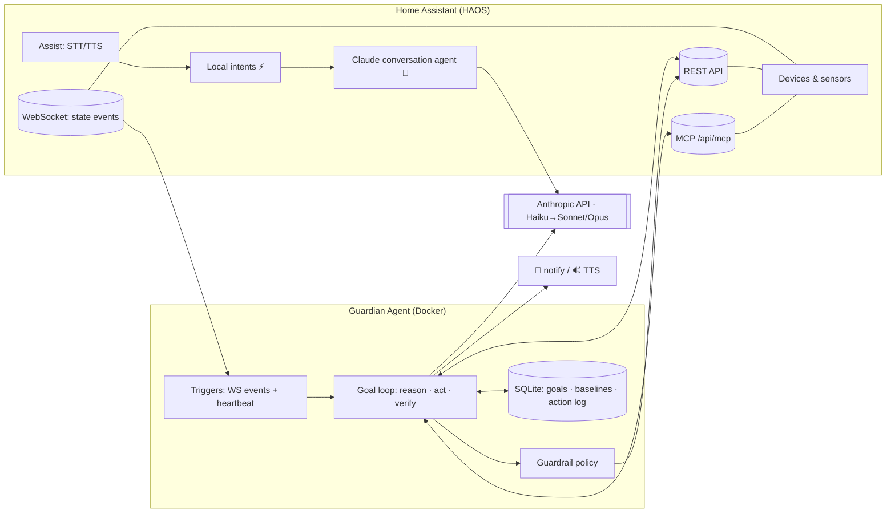
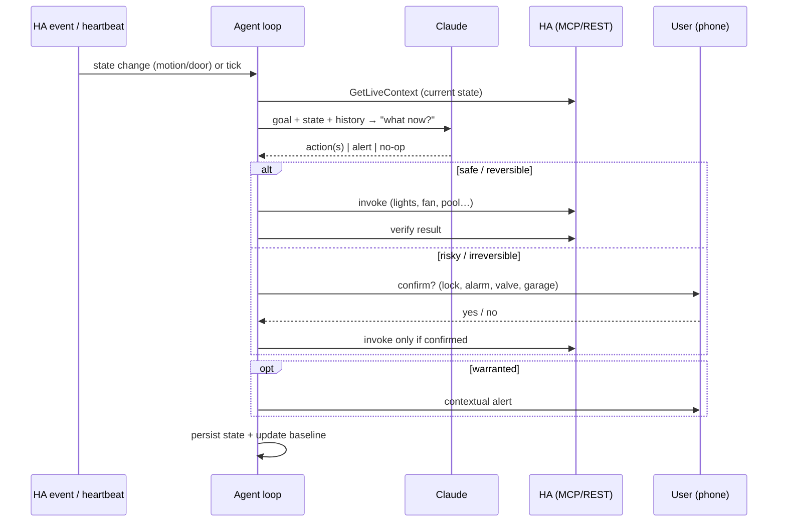
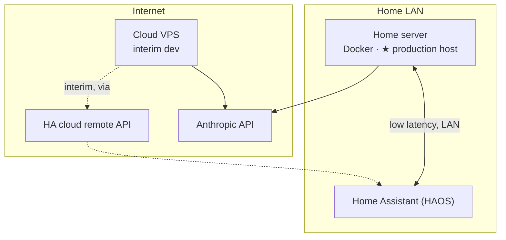
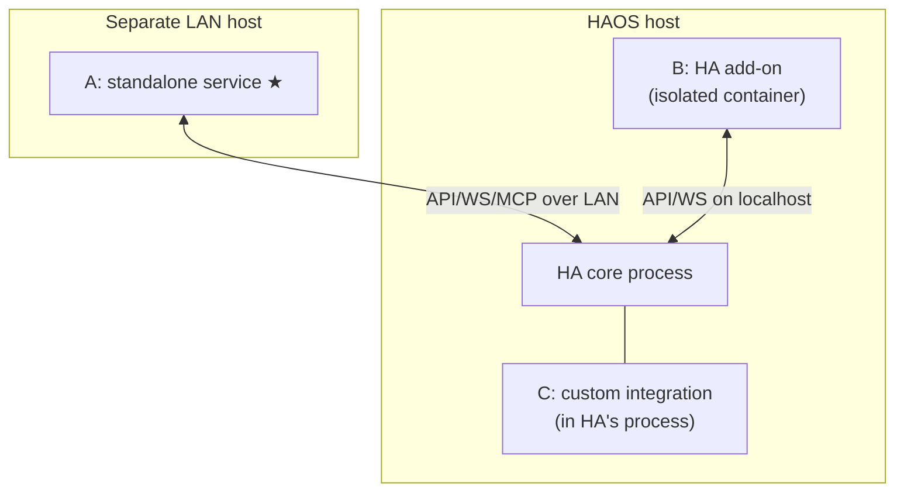

# Architecture

## Design principle

Beat off-the-shelf voice assistants on **both** axes:
- **Speed** — common commands ("turn off the kitchen lights") resolve via HA's local intent
  engine in ~milliseconds, no LLM round-trip.
- **Intelligence** — anything conversational, ambiguous, or multi-step falls through to Claude,
  which reasons and can fire several coordinated actions.

A naive "send everything to an LLM" design would be *slower* than a local assistant. The hybrid
fast-path + smart-path is the whole trick.

## Three layers

### Layer 1 — Voice/chat front-end
HA's **Assist** pipeline (wake word → STT → conversation agent → TTS) with the conversation agent
set to **prefer local intents, fall back to Claude** (HA *Anthropic Conversation* integration).
HA-config only — no service to host. Voice satellites (HA Voice PE / ESPHome, "Jarvis" wake word)
are an optional later add; text/app works day one. On Android, HA Assist can be set as the
device's default assistant (replacing the stock one).

**What the front-end can / can't answer** (when set as your phone assistant):
- ✅ Home control, general knowledge, unit conversions, reasoning (from Claude's own knowledge).
- ✅ Local weather — read from the HA weather entity (current + forecast), not a web lookup.
- ❌ **Live web search / real-time facts** (news, scores, "search the web") — Claude in HA has no
  internet tool by default; it answers from training knowledge or declines. Addable later by
  wiring a web-search tool/MCP into the agent — the one capability gap vs. a cloud assistant.

### Layer 2 — Guardian agent service (the novel core)
A persistent, goal-driven Claude agent. Two goal shapes, one engine:
- **Watch-goals** ("keep an eye", "look after the house") — long-running; wakes on HA WebSocket
  state-changes (instant) + a periodic heartbeat; compares to a learned baseline; acts/alerts
  **only when warranted**.
- **Do-goals** ("clean the pool") — one-shot: interpret → discover capability → act →
  **verify it happened** → report.

### Layer 3 — Proactive layer
Scheduled/event-driven intelligence the agent initiates: morning briefing, anomaly heads-up,
freeze/leak/energy guardians, "leave-soon" nudges. Emerges from the Layer 2 engine.

## System diagram

## The goal loop

## Deployment topology

**Production** is a **LAN-local home server** (low latency to HA, no internet dependency for local
control — important, since a guardian on a remote host is blind during WAN outages). A **cloud VPS**
reaching HA via its **cloud remote API** is fine for interim development.

## Where the agent runs (hosting placement)

Layer 1 (the conversation agent) **already runs inside HA** — it's an HA integration. The real
question is **Layer 2, the guardian service.** Three placements:

| | **A. Standalone on LAN host ★** | **B. HA add-on** | **C. Custom integration (in-process)** |
|---|---|---|---|
| Latency to HA | LAN, ~1ms | localhost | none (in-process) |
| Survives WAN outage | ✅ local | ✅ | ✅ |
| Blast radius if it misbehaves | isolated | isolated container | ⛔ can crash HA |
| Coupled to HA restarts/backups | no | partial | full |
| Iteration / CI-CD speed | fast (own pipeline) | slower (build/install) | slowest, risky |
| Needs a separate always-on host | yes | no | no |

**Recommendation: A — standalone service on a LAN-local host.** HA stays a stable,
backup-critical appliance; the agent gets an independent lifecycle (fast iteration, easy
rollback, its own CI/CD); and co-locating on the same LAN gives ~all the latency/offline benefits
of "inside HA" without the coupling.

- Choose **B (add-on)** only if there's *no* separate always-on LAN host — it's the acceptable
  "inside HA" form: an isolated container that just happens to be hosted by HA's supervisor.
  (AppDaemon is a similar middle ground.)
- **Avoid C (custom integration / in-process).** A long-running LLM agent with a bug or memory
  leak would take the whole smart home down with it.

## Tech stack

- **Language/SDK:** TypeScript + `@anthropic-ai/sdk` (or the Claude Agent SDK) — a tool-use loop.
- **Model tiering:** Haiku for routine "is this normal?" checks; escalate to Sonnet/Opus for
  judgment & multi-step planning. Event-driven (one call per real event) → low cost.
- **HA access:** REST + WebSocket (state subscription) + MCP (`GetLiveContext`, `Hass*`); plus
  camera snapshot, calendar, history/logbook, notify, tts.
- **State:** SQLite — active goals, baselines, action log, agent memory.
- **Deploy:** Docker + a reverse proxy; `compose.yml` / `.env`; a `/healthz` endpoint.
- **Secrets:** a dedicated project Anthropic key + a dedicated scoped HA token; `.env` / secrets
  manager only — never committed.

## Tool-use safety order

Actions prefer the most constrained surface that does the job — **MCP → REST API → SSH**. The
agent's guardrails ([GUARDRAILS.md](GUARDRAILS.md)) encode the same instinct for autonomous actions.
