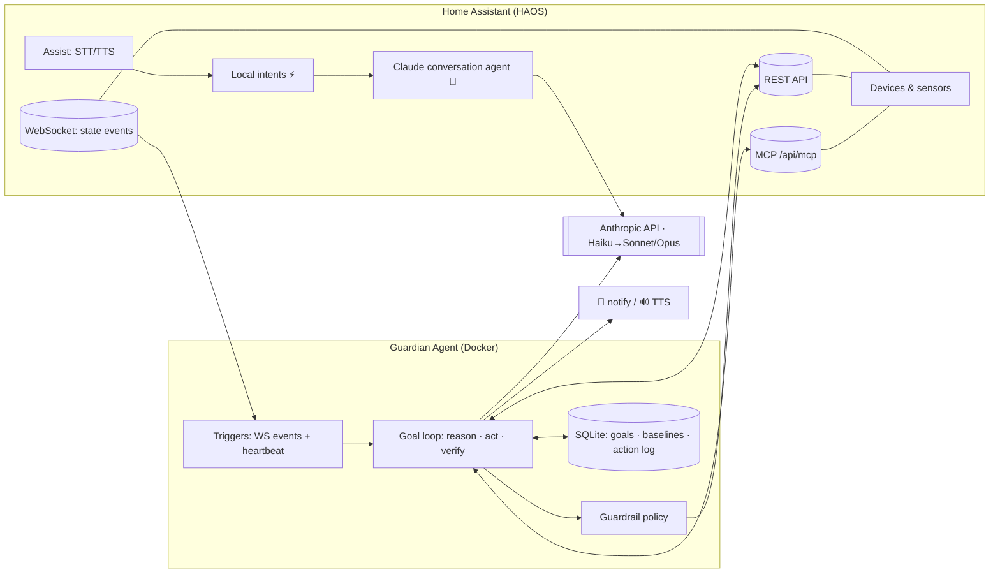
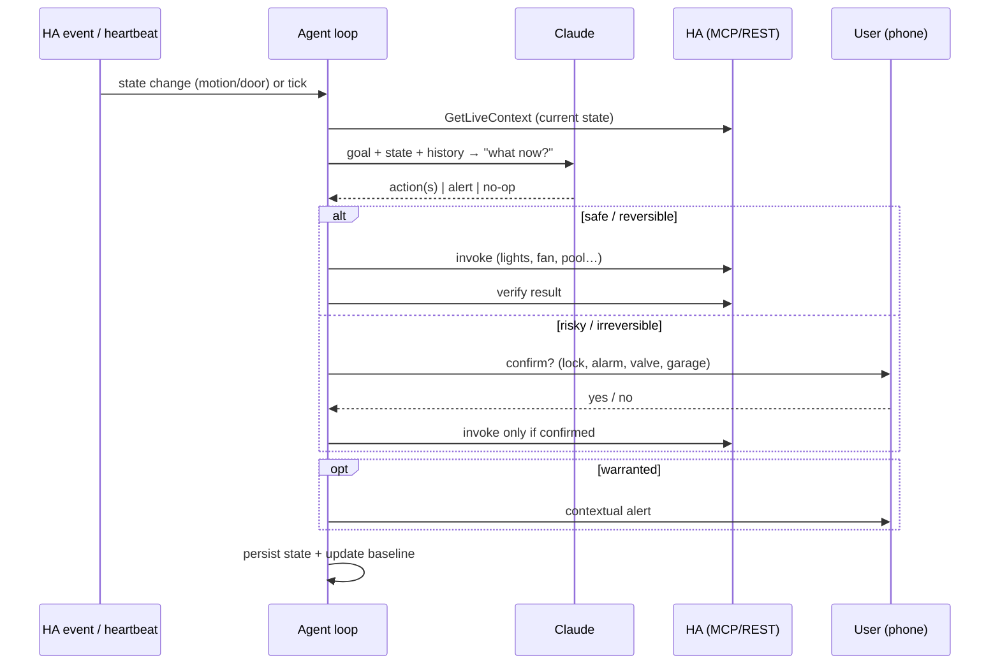
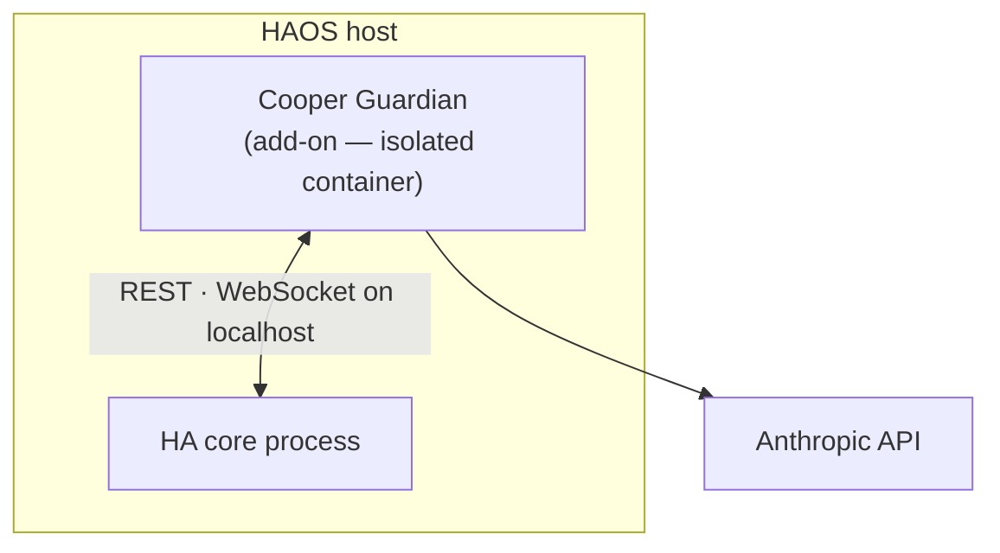

# Architecture

## Design principle

Beat off-the-shelf voice assistants on **both** axes:
- **Speed** — common commands ("turn off the kitchen lights") resolve via HA's local intent
  engine in ~milliseconds, no LLM round-trip.
- **Intelligence** — anything conversational, ambiguous, or multi-step falls through to Claude,
  which reasons and can fire several coordinated actions.

A naive "send everything to an LLM" design would be *slower* than a local assistant. The hybrid
fast-path + smart-path is the whole trick.

## Three layers

### Layer 1 — Voice/chat front-end
HA's **Assist** pipeline (wake word → STT → conversation agent → TTS) with the conversation agent
set to **prefer local intents, fall back to Claude** (HA *Anthropic Conversation* integration).
HA-config only — no service to host. Voice satellites (HA Voice PE / ESPHome, "Cooper" wake word)
are an optional later add; text/app works day one. On Android, HA Assist can be set as the
device's default assistant (replacing the stock one).

**What the front-end can / can't answer** (when set as your phone assistant):
- ✅ Home control, general knowledge, unit conversions, reasoning (from Claude's own knowledge).
- ✅ Local weather — read from the HA weather entity (current + forecast), not a web lookup.
- ⚠️ **Live web search / real-time facts** (news, scores, "search the web") — Claude in HA has no
  internet tool by default. **This is a required capability** (the assistant can't replace a cloud
  assistant on a phone without it), so a web-search tool is part of Layer 1, not optional:
  - **Route A (fast):** add a `web_search` tool — a `rest_command`/`script` calling a search API
    (Tavily, Brave Search, etc.) — and expose it to the conversation agent.
  - **Route B (best):** route HA Assist to a custom Claude backend with Anthropic's native
    `web_search` server-tool enabled (also unifies the brain with the guardian agent).
  - Needs a dedicated search-API key, never committed.

### Layer 2 — Guardian agent service (the novel core)
A persistent, goal-driven Claude agent. Two goal shapes, one engine:
- **Watch-goals** ("keep an eye", "look after the house") — long-running; wakes on HA WebSocket
  state-changes (instant) + a periodic heartbeat; compares to a learned baseline; acts/alerts
  **only when warranted**.
- **Do-goals** ("clean the pool") — one-shot: interpret → discover capability → act →
  **verify it happened** → report.

### Layer 3 — Proactive layer
Scheduled/event-driven intelligence the agent initiates: morning briefing, anomaly heads-up,
freeze/leak/energy guardians, "leave-soon" nudges. Emerges from the Layer 2 engine.

## System diagram

## The goal loop

## Deployment — a Home Assistant add-on

Cooper Guardian ships as an **HA add-on**: an *isolated container* managed by HA's supervisor (not
code running inside HA's process). It runs on the HA box itself, so it's **LAN-local, low-latency,
and survives WAN outages** from day one, with no separate host to maintain.

Why an isolated add-on rather than a custom integration that runs *inside* HA: a long-running LLM
agent with a bug or memory leak should never be able to take the whole smart home down with it. An
add-on container is firewalled from HA core — its blast radius is itself.

The same image also runs as a plain **standalone Docker container** for local development (point it
at HA with `HA_URL` + `HA_TOKEN` instead of the supervisor token) — handy for iterating without a
build/install cycle on the HA box.

## Tech stack

- **Language/SDK:** TypeScript + `@anthropic-ai/sdk` (or the Claude Agent SDK) — a tool-use loop.
- **Model tiering:** Haiku for routine "is this normal?" checks; escalate to Sonnet/Opus for
  judgment & multi-step planning. Event-driven (one call per real event) → low cost.
- **HA access:** REST + WebSocket (state subscription) + MCP (`GetLiveContext`, `Hass*`); plus
  camera snapshot, calendar, history/logbook, notify, tts.
- **State:** SQLite — active goals, baselines, action log, agent memory.
- **Deploy:** Docker + a reverse proxy; `compose.yml` / `.env`; a `/healthz` endpoint.
- **Secrets:** a dedicated project Anthropic key + a dedicated scoped HA token; `.env` / secrets
  manager only — never committed.

## Tool-use safety order

Actions prefer the most constrained surface that does the job — **MCP → REST API → SSH**. The
agent's guardrails ([GUARDRAILS.md](GUARDRAILS.md)) encode the same instinct for autonomous actions.
