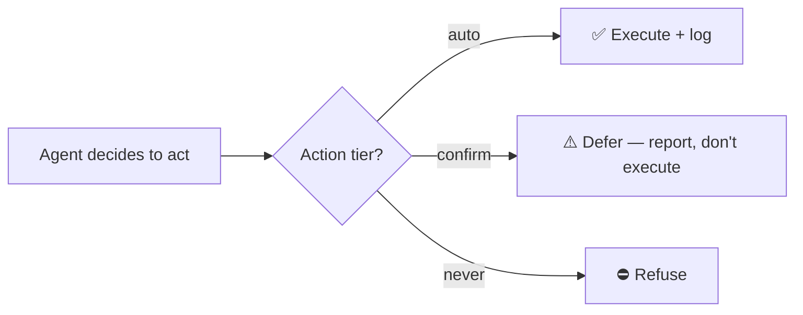

# Autonomy & guardrails

The make-or-break of a home agent that *acts*. Policy: **act on safe/reversible, confirm risky,
never do the forbidden.** Enforced in code (`addon/src/guardrails.ts`), not left to the model's
discretion.

## Action tiers

Tiers are keyed by HA `domain.service`:

**🟢 Auto (reversible, low-stakes)** — executed directly (when not in observe mode):
domains `light`, `fan`, `switch`, `climate`, `media_player`, `humidifier`, `scene`, `notify`, `tts`.

**🟡 Confirm (sensitive / could trap / irreversible)** — Cooper does **not** execute; it returns a
"deferred for confirmation" result and tells you what it *would* do:
`lock`/`unlock`, alarm `arm_*`/`disarm`, water `valve` open/close, `cover.close_cover` (garage/
awning close — closing can trap; opening is auto), `siren.turn_on`. **Anything not in the auto list
defaults to confirm** (conservative).

**🔴 Never** — refused outright: HA `config`/`hassio`/`homeassistant` `delete`/`remove`/`purge`
(integration/system mutation & deletions).

## Controls in place today

- **Observe mode** (default on) — Cooper reads, reasons, and *logs intended* device actions but
  takes none, until you trust it. (Notifications still fire — that's how it talks to you.)
- **Anti-hallucination guard** — `call_service` rejects any target entity that doesn't exist, so
  Cooper can't act on (or claim to control) an invented device.
- **Rate limits** — a per-goal cooldown plus hourly/daily LLM-call caps (the cost guard) prevent
  alert spam and action thrashing; over the cap, automatic evaluations pause.
- **Action log** — every evaluation and action is written to SQLite (timestamp, goal, decision,
  result), surfaced via `/healthz`.
- **Faithful reporting** — the agent must report results truthfully: `[observe]` = not performed,
  `DEFERRED` = needs confirmation; never claim a success it didn't do.

## Planned / not yet enforced

Honest about the gap — design intent, not yet implemented: an interactive two-way **Yes/No
confirmation** notification (today, confirm-tier actions are deferred + reported, not prompted), a
global **kill-switch** helper, **per-goal entity allowlists**, and mirroring the log to the **HA
logbook**.

## Principle

A careful operator uses the **least-powerful surface that does the job** and keeps a human in the
loop on anything irreversible. Cooper reaches HA only over its local **REST + WebSocket** API (no
shell, no config-file access), and its tiers codify that same posture — so its autonomy never
exceeds what a careful operator would do by hand.
