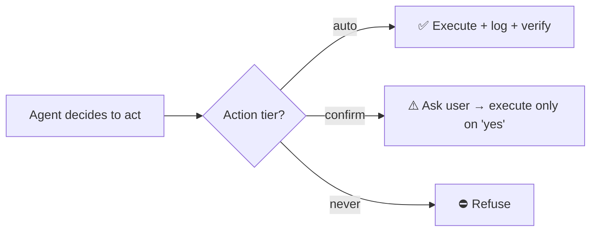

# Autonomy & guardrails

The make-or-break of a home agent that *acts*. Policy: **act on safe/reversible, confirm risky,
never do the forbidden.** Enforced in the agent — not left to the model's discretion.

## Action tiers

**🟢 Auto-allowed (reversible, low-stakes):**
lights, fans, media players, pool pump, humidifiers, scenes, notifications, TTS announcements.

**🟡 Confirm-required (sensitive / irreversible / could trap-expose-cost):**
lock / unlock, alarm arm / disarm, the **water valve**, garage & awning close, sirens,
irrigation runs of unusual length, anything with a real-world cost.

**🔴 Never autonomous:**
account changes, purchases, sharing/permissions, deletions.

## Cross-cutting controls

- **Everything logged** — to SQLite *and* the HA logbook (timestamp, goal, decision, action, result).
- **Per-goal action allowlists** — a goal can only touch the entities/tiers it was scoped to.
- **Observe / dry-run mode** — default for new goals: reason + log *intended* actions, take none,
  until trusted.
- **Rate limits / cooldowns** — prevents alert spam and action thrashing ("keep an eye" must not
  ping you every time the cat moves).
- **Global kill switch** — an `input_boolean` that halts all autonomous action immediately.
- **Two-way confirmations** — risky actions become a notification with Yes/No; no reply = no action.
- **Tool order** — prefer MCP, then REST, then SSH: the least-powerful surface that does the job.

## Principle

A careful operator prefers the least-powerful tool that does the job (**MCP → API → SSH**) and
keeps a human in the loop on anything irreversible. The agent codifies that same posture, so its
autonomy never exceeds what a careful operator would do by hand.
