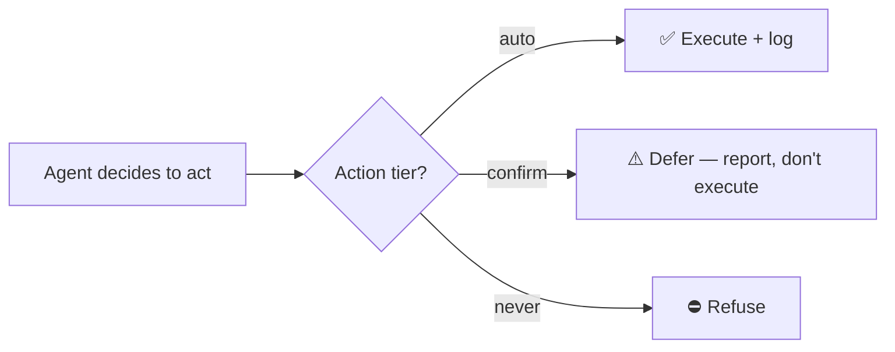

# Autonomy & guardrails

The make-or-break of a home agent that *acts*. Policy: **act on safe/reversible, confirm risky,
never do the forbidden.** Enforced in code (`addon/src/guardrails.ts`), not left to the model's
discretion.

## Action tiers

Tiers are keyed by HA `domain.service`:

**🟢 Auto (reversible, low-stakes)** — executed directly (when not in observe mode):
domains `light`, `fan`, `switch`, `climate`, `media_player`, `humidifier`, `scene`, `notify`,
`tts`, `script`, `automation` (running a rule is as safe as the vetted actions inside it),
`conversation` (the `conversation.process` judgment callback is the core pattern, not a risky
action), and `counter` (increment/reset for "N times" lifecycles).

**🟡 Confirm (sensitive / could trap / irreversible)** — Cooper does **not** execute; it returns a
"deferred for confirmation" result and tells you what it *would* do:
`lock`/`unlock`, alarm `arm_*`/`disarm`, water `valve` open/close, `cover.close_cover` (garage/
awning close — closing can trap; opening is auto), `siren.turn_on`. **Anything not in the auto list
defaults to confirm** (conservative).

**🔴 Never** — refused outright: HA `config`/`hassio`/`homeassistant` `delete`/`remove`/`purge`
(integration/system mutation & deletions).

## Controls in place today

- **Observe mode** (default on) — Cooper reads, reasons, and *logs intended* device actions but
  takes none, until you trust it. (Notifications still fire — that's how it talks to you.)
- **Interactive two-way Yes/No confirmation** — confirm-tier actions aren't just deferred and
  reported; you actually get asked. In-chat during a conversation Cooper waits on your yes/no, and
  for autonomous/callback cases it fires a push notification with Yes/No actions and acts on your
  answer.
- **Global kill-switch** — `input_boolean.cooper_pause`, self-provisioned on first run. Flip it on
  to halt all actions immediately, no redeploy needed.
- **Authored rules are guardrailed at authoring.** A native HA automation Cooper writes runs with
  no human in the loop, so the **same action tiers** are applied to the actions *inside* it when
  it's authored: a forbidden action is refused, and a risky one is refused with a nudge to
  alert-a-human (`notify` / `conversation.process` callback) instead of acting autonomously.
- **Deterministic validation** — before an authored automation/script is saved, the host verifies
  (no LLM, can't be fooled) that every `entity_id` and every service it references actually
  **exists**, and lints `notify` photo attachments. Cooper can't save a rule that silently fails on
  a phantom target.
- **Advisory intent check** — a light pass flags when an authored rule's scope/lifecycle doesn't
  match the request (e.g. a "for 2 hours" watch that never stops) and nudges Cooper to fix it; it
  never blocks or loops.
- **Dead-rule cleanup** — one-shot rules that can no longer fire (their date has passed) are
  deleted automatically; nothing accumulates.
- **Anti-hallucination guard** — `call_service` rejects any target entity that doesn't exist, so
  Cooper can't act on (or claim to control) an invented device.
- **Rate limits** — a per-goal cooldown plus hourly/daily LLM-call caps (the cost guard) prevent
  alert spam and action thrashing; over the cap, automatic evaluations pause.
- **Action / audit log** — every evaluation and action is written to SQLite (timestamp, goal,
  decision, result), surfaced via `/healthz`. The store is now **only** an audit log.
- **Faithful reporting** — the agent must report results truthfully: `[observe]` = not performed,
  `DEFERRED` = needs confirmation; never claim a success it didn't do.

## Principle

A careful operator uses the **least-powerful surface that does the job** and keeps a human in the
loop on anything irreversible. Cooper reaches HA only over its local **REST + WebSocket** API (no
shell, no config-file access), and its tiers codify that same posture — so its autonomy never
exceeds what a careful operator would do by hand.
